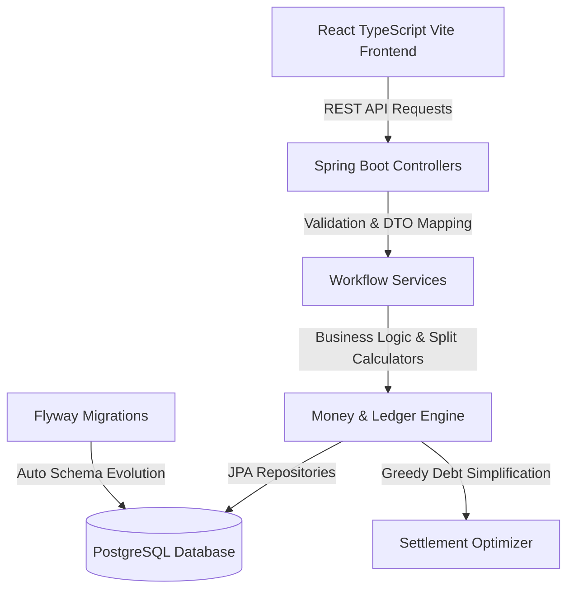
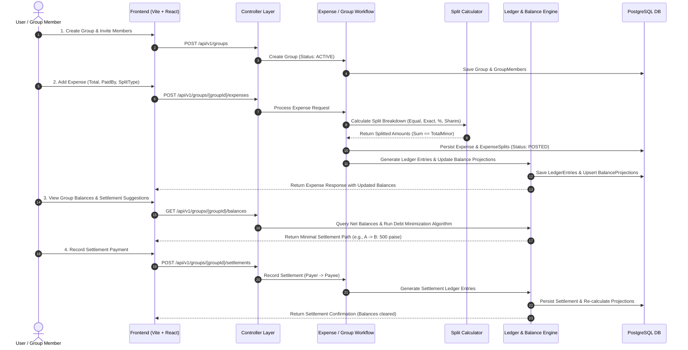
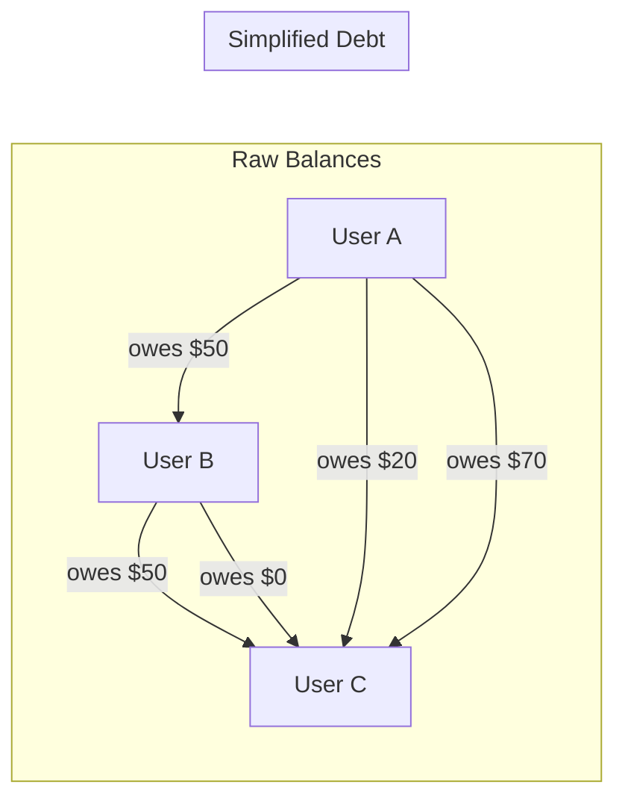

# SettleSense - Complete Project System & Functional Flow

This document defines the complete end-to-end flow of the SettleSense system—from user onboarding, group management, and expense splitting to double-entry ledger posting, settlement simplification, and AI insights.

---

## 1. System Overview & Core Architecture

SettleSense is a high-precision group expense tracking and settlement engine built with a multi-layered monorepo architecture:

- **Frontend**: React 18 + TypeScript + Vite + CSS (SPA UI with real-time balance calculations and interactive expense split creation).
- **Backend**: Java 17 + Spring Boot 3.x (Layered Architecture: Controller → Service → Repository → PostgreSQL).
- **Database & Migration**: PostgreSQL 16 managed via Flyway versioned migrations (`V1__...`, `V2__...`).
- **Infrastructure & Containerization**: Local Docker Compose setup (`docker/docker-compose.yml`) running PostgreSQL 16 & optional Redis rate-limiting service.



---

## 2. Core Domain Model & Money Rules

Financial accuracy is the foundational requirement of SettleSense:

1. **Integer Minor Units (Paise)**: All money amounts are strictly stored as integer minor units (e.g., ₹150.75 is stored as `15075` paise). Floating-point math is prohibited in financial paths.
2. **Single Group Currency**: In Phase 1, each group has a locked single currency (`currencyCode` e.g., `INR`). All group transactions, ledger entries, and balance projections share this currency.
3. **Immutable Ledger Source of Truth**: Balances are derived from double-entry style `LedgerEntry` records. Source records (expenses and settlements) are append-only. Edits and cancellations create reversing ledger entries rather than deleting historical rows.
4. **Explainability**: Every net balance projection like "User A owes User B ₹500" can be deterministically audited by summing ledger entries back to source expense/settlement IDs.

---

## 3. End-to-End System & User Journeys



---

## 4. Detailed Component Flows

### Flow A: Group & User Onboarding
1. User registers or is fetched (`/api/v1/users`). User status set to `ACTIVE`.
2. User creates a Group (`/api/v1/groups`) specifying group `name` and `currencyCode` (e.g., `INR`).
3. Members are added via `GroupMember` with roles (`OWNER`, `MEMBER`).
4. Once an expense or settlement is created, the group's `currencyCode` becomes immutable.

### Flow B: Expense Creation & Splitting Engine
1. **Input Payload**: `groupId`, `payerUserId`, `description`, `totalMinor`, `splitType` (`EQUAL`, `EXACT`, `PERCENTAGE`, `SHARES`), and list of splits.
2. **Validation**:
   - `totalMinor` must be positive.
   - Payer and all split participants must be active group members.
   - Split allocations must equal `totalMinor` exactly.
3. **Remainder Handling**: For division remainders (e.g. ₹100 divided 3 ways = 3333, 3333, 3334 paise), the engine deterministically allocates remainder paise to the primary payer or first listed member to ensure exact zero-sum ledger balance.
4. **Persistence**: `Expense` is created with status `POSTED`. `ExpenseSplit` records created.

### Flow C: Double-Entry Ledger & Balance Projection Flow
1. For an expense of total $T$ paid by User $P$ and split among participants $U_i$ with split amounts $S_i$:
   - For payer $P$: Credit entry generated (+ $T - S_P$).
   - For each owe member $U_i$ ($i \neq P$): Debit entry generated (- $S_i$).
2. **Balance Projection Update**:
   - Pairwise balance $B(A, B)$ is updated: $B(A, B) = \sum \text{LedgerEntries}(A \rightarrow B)$.
   - Net balance $N(U) = \sum \text{Credits} - \sum \text{Debits}$.

### Flow D: Greedy Debt Simplification Algorithm
To eliminate complex circular debts (e.g., A owes B $10, B owes C $10, C owes A $10):
1. Compute net balance $N(u)$ for all members in group $G$.
2. Separate members into `Debtors` ($N(u) < 0$) and `Creditors` ($N(u) > 0$).
3. Sort Debtors in ascending order of balance (largest debt first) and Creditors in descending order (largest credit first).
4. Greedily match maximum debtor with maximum creditor:
   - Settle amount $M = \min(|N(\text{Debtor})|, N(\text{Creditor}))$.
   - Record suggested settlement: $\text{Debtor} \rightarrow \text{Creditor}$ for amount $M$.
   - Adjust remaining balances and repeat until all balances are zero.
5. Result: Reduces $O(N^2)$ direct debts to at most $N-1$ transaction payments.



### Flow E: Expense Editing & Cancellation Reversal
1. Physical deletes are forbidden for posted financial records.
2. When an expense is cancelled (`POST /api/v1/expenses/{id}/cancel`):
   - Expense status changes from `POSTED` to `CANCELLED`.
   - Engine issues **Compensating Reversing Ledger Entries** for every original ledger entry associated with the expense.
   - Balance projections are updated by adding the compensating entries, cleanly reverting the group balance state.
3. When an expense is edited, the original expense is cancelled via reversing entries, and a replacement expense with the updated figures is posted in the same atomic database transaction.

### Flow F: AI Assistant & Insights Flow
1. **Request**: User requests spending breakdown, settlement recommendations, or expense categorizations.
2. **Insight Service**: Queries group ledger history, spending velocity, and member balances.
3. **Structured Prompt / Analysis**: Formats spending data into clean JSON context.
4. **AI Recommendation**: Delivers natural language insights (e.g., "User A has paid 70% of group costs this month. Suggested settlement: User B pay User A ₹1,200 via UPI").

---

## 5. Directory Structure & File Mapping

```
SettleSense/
├── docs/                                  # Master Documentation Suite
│   ├── FLOW.md                            # Complete Project Architecture & Flow (This file)
│   ├── INSTRUCTIONS.md                    # Engineering & Coding Conventions
│   ├── README.md                          # Quickstart & Repository Overview
│   ├── ROADMAP.md                         # Product & Learning Phased Roadmap
│   ├── DECISIONS.md                       # Architecture Decision Records (ADRs)
│   ├── IMPLEMENTATION_STATUS.md           # Implementation progress tracking
│   ├── development.md                     # Environment & local execution guide
│   └── phase-1-domain-model-and-money-rules.md # Deep-dive money & ledger rules
├── backend/                               # Spring Boot 3.x Java Service
│   ├── src/main/java/com/kelvin/settlesense/
│   │   ├── api/                           # REST Controllers & DTOs
│   │   ├── domain/                        # Entities & Enums (User, Group, Expense, LedgerEntry)
│   │   ├── repository/                    # JPA Repositories
│   │   ├── service/                       # Workflow, Money & Split Calculation Services
│   │   └── config/                        # Security, Cors, Time & App Beans
│   └── src/main/resources/db/migration/   # Flyway Schema Migrations (V1, V2...)
├── frontend/                              # Vite + React 18 SPA
│   ├── src/
│   │   ├── components/                    # UI Components (GroupCard, ExpenseModal, SettlementList)
│   │   ├── services/                      # API Axios/Fetch Service Layer
│   │   ├── types/                         # TypeScript interfaces & domain DTOs
│   │   └── App.tsx                        # Main Dashboard & Router
└── docker/                                # Containerization & Compose setup
    └── docker-compose.yml                 # PostgreSQL 16 & Redis infrastructure
```

---

## 6. Verification & Health Checks

To verify the flow end-to-end locally:

```powershell
# 1. Start Infrastructure
docker compose -f docker/docker-compose.yml up -d

# 2. Run Backend & Execute Migration + Tests
cd backend
.\gradlew.bat test
.\gradlew.bat bootRun

# 3. Run Frontend
cd ..\frontend
npm run lint
npm run build
npm run dev
```

Health Verification Endpoint: `GET http://localhost:8080/api/health` -> `200 OK` `{"status":"UP"}`.
